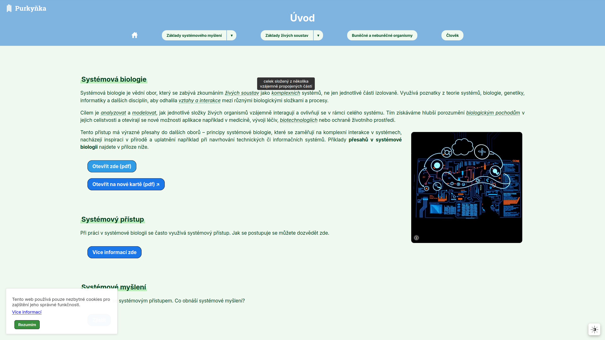
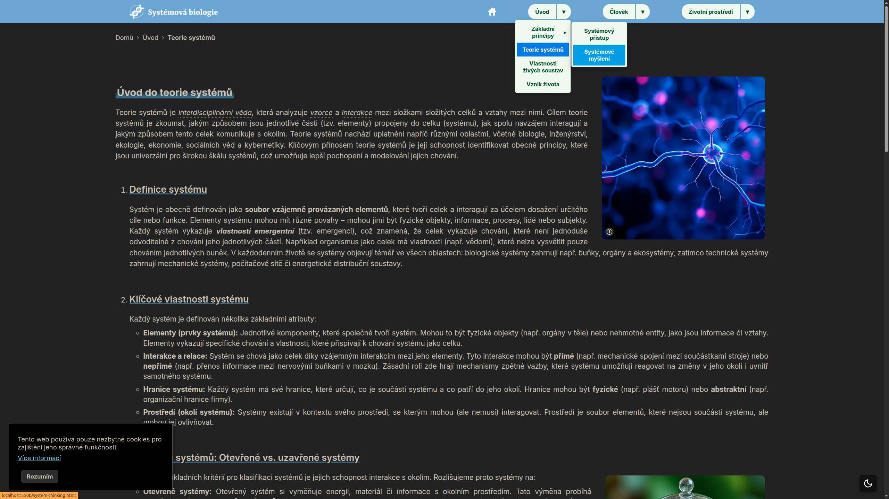
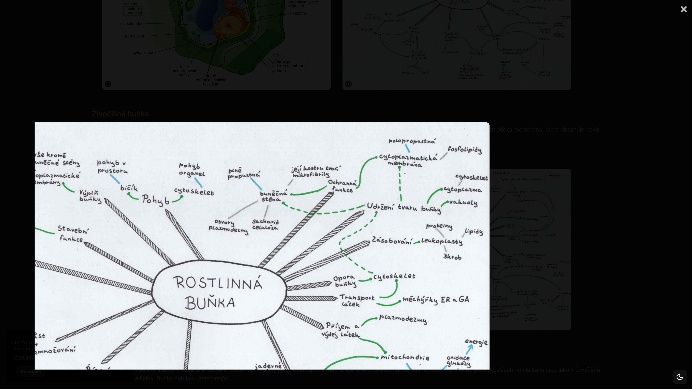
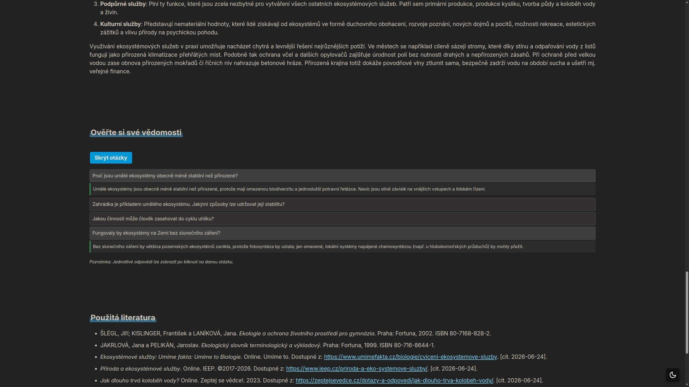

# Web o Systémové biologii
Náš moderní a interaktivní web je věnován systémové biologii s důrazem na souvislosti s ostatními přírodovědnými obory.
Vytvořili jsem ho pro ostatní studenty technického lycea SPŠ Brno, Purkyňova jako vzdělávací prostředek a může sloužit pro shrnutí učiva, jako edukační nástroj do výuky či k rozšíření znalostí.

## Instalace a spuštění
### 1. Stažení pomocí nástroje git
Pro spuštění webu naklonujte náš repozitář: 
```bash
git clone https://github.com/gazmichaela/biology.git
```
Poté můžete spustit web jako lokální HTML soubor ve vašem prohlížeči nebo na vašem serveru. Nejsou nutné upravovat žádné soubory či nastavení webu.
Pro provoz webu můžete bezpečně odstranit složky docs, .git a .vscode, které nejsou nezbytné pro provoz webu.

### 2. Stažení přes github.com
Alternativně si můžete stáhnout .zip soubor projektu z webových stránek GitHubu, bez možnosti přispívání do projektu nástrojem git.

## Použité technologie
- HTML5
- CSS3 
- JavaScript ES6+                                                               

## Podporované prohlížeče
Web je určen pro moderní prohlížeče, ale snažili jsme se také zachovat kompatibilitu s několik let starými prohlížeči.
Byl důkladně testován na následujících verzích prohlížečů:
- Chrome 140,
- Firefox 141,
- Edge 140.

Web bude fungovat i na starších verzích prohlížečů (pokud se nejedná o historické verze), ale není garantováno.
Internet Explorer není podporován.

## Struktura projektu
- /css/
- /docs/ - dokumentace ke JS
- /favicon/ - různé formáty loga
- /fonts/ - stažené fonty
- /images/ - png a webp soubory 
- /js/
- /pdf/
- /pwa/ - service-worker
- soubory HTML a manifest.json (pro PWA)
  
## Funkce
Mezi hlavní funkce na webu patří:
- responzivní design (desktop, mobile, printer),
- navigace (desktop, mobile),
- sticky header,
- přepínání světlého a tmavého režimu,
- zvětšování a přibližování některých obrázků,
- zobrazení významů slov,
- interaktivní otázky a další.

Web byl také optimalizován pro čtečky obrazovky.

## Ukázky webu
1. Světlý motiv s otevřeným tooltipem


2. Tmavý motiv s otevřenou navigací


3. Přiblížený zvětšený obrázek


4. Interaktivní otázky

## Poděkování 
Děkujeme za pomoc při tvorbě obsahu na webu doc. RNDr. Aleši Rudovi Ph.D., MBA; Mgr. Nataše Berkové; Ing. Ditě Tůmové; Mgr. Denise Kalokové.

## Autoři
- Michaela Gažová
- Daniel Friedl 
